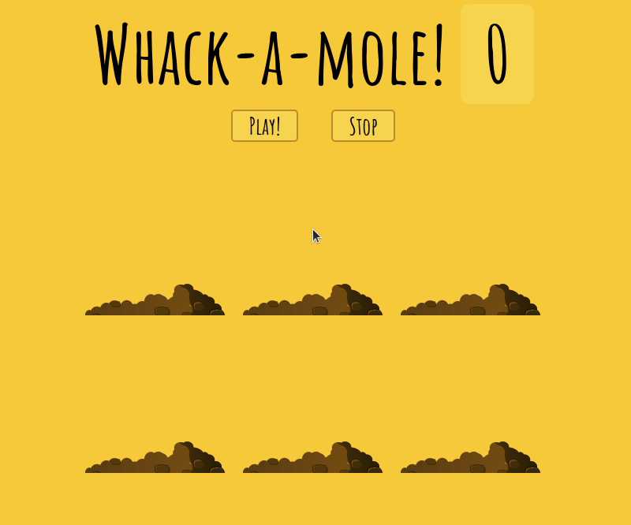

<!-- README.md is generated from README.Rmd. Please edit that file -->

```{r, include = FALSE}
knitr::opts_chunk$set(
  collapse = TRUE,
  comment = "#>",
  fig.path = "man/figures/README-",
  out.width = "100%"
)
```

# whackamole

<!-- badges: start -->
<!-- badges: end -->

Simple Whack-A-Mole game in Shiny.

## Installation


And this package from [GitHub](https://github.com/) with:

``` r
# install.packages("devtools")
devtools::install_github("tomicapretto/whackamole")
```

## Run application

The function `run_app()` fires up the game. Just do

``` r
whackamole::run_app()
```

and have fun!

## The game in action


The game does not look that slow, there's a problem with the .gif I can't
figure out yet.
